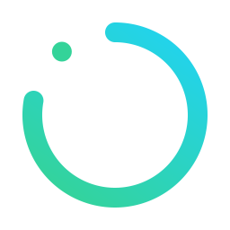
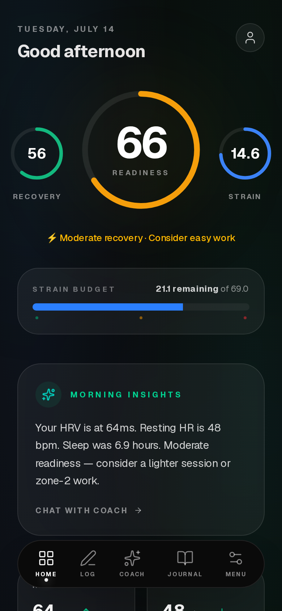
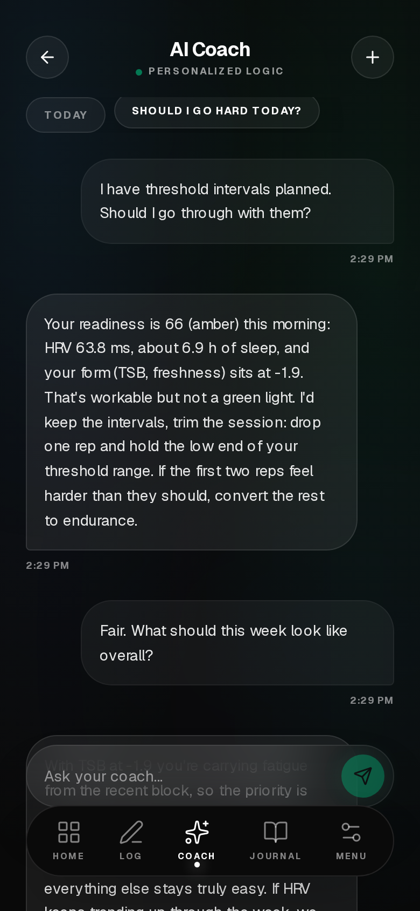
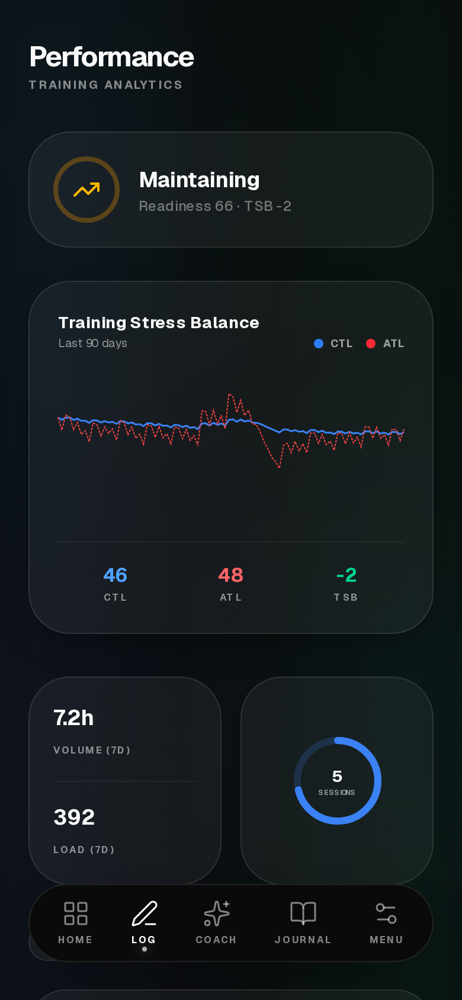
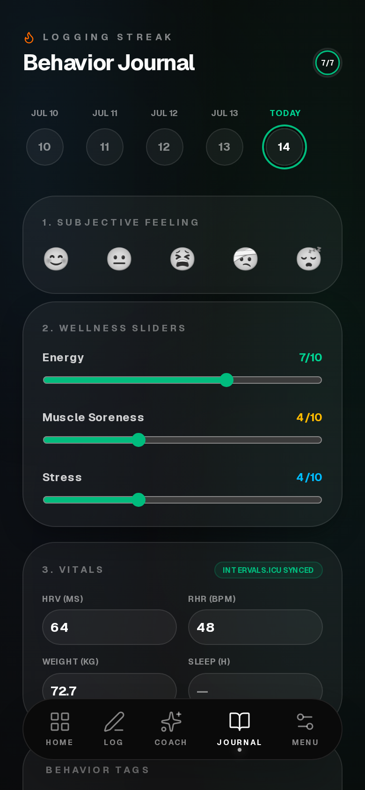

<p align="center">
  
</p>

<h1 align="center">Recover</h1>

<p align="center"><b>Your training and recovery, in one calm place — self-hosted and free.</b></p>

<p align="center">
  <a href="https://github.com/crunchynapkin404/Recover/actions/workflows/ci.yml"></a>
  <a href="https://github.com/crunchynapkin404/Recover/releases"></a>
  <a href="LICENSE"></a>
</p>

<p align="center">
  
  
  
  
</p>

Recover is a Whoop-style health and training companion you run on your own
hardware: readiness scoring, training load, a behavior journal, and an AI coach
— without the subscription, the wearable lock-in, or anyone else holding your
data. It pulls wellness (HRV, resting HR, sleep) and activities from
intervals.icu into your own Postgres, computes a daily readiness score from
_your_ personal baselines — not population norms — and shows it on one calm
dashboard.

## Your Claude, your training data

The part we care most about: Recover ships a **built-in MCP server**, so
claude.ai, Claude Code, or any MCP client can read your readiness, wellness,
and training load with a scoped, revocable token.

> **You:** How has my week been? Should I still do intervals tomorrow?
>
> **Claude** _(via your Recover MCP connector)_: Your readiness is 66 (amber)
> — HRV 63.8 ms against a 65 ms baseline, TSB −1.9 after Saturday's long ride…

The in-app coach uses the same tools with your own LLM key — Anthropic, or any
OpenAI-compatible endpoint including a fully local Ollama. Keys are encrypted
(AES-256-GCM) in your database; nothing phones home.

## Features

- **Readiness score** from 60-day rolling personal baselines: HRV (40%),
  resting HR (25%), sleep (20%), form/TSB (15%) — with an honest
  "calibrating" state until enough history exists, and a component breakdown
  explaining every score.
- **intervals.icu sync** — wellness, activities, and training load, kept fresh
  by an in-process scheduler. **Strava OAuth** as a second source, with
  provenance tracking (Strava data is excluded from AI context by default, per
  Strava's API terms).
- **Analytics depth** — open any activity for stream charts (HR, power, pace,
  elevation) and laps; track fitness with CTL/ATL/TSB over 30–365 day ranges;
  watch HRV, resting HR, and sleep trend against your personal baselines.
- **AI coach** — evidence-based endurance-coach persona that cites the actual
  numbers from your data, adapts its tone to your readiness band, and refuses
  to program through injury or illness. BYO key: Anthropic or any
  OpenAI-compatible endpoint (Ollama included).
- **MCP server** — stateless streamable-HTTP endpoint at `/api/mcp` with
  hashed, scoped (`read` / `write:wellness`), revocable bearer tokens and rate
  limiting.
- **Installable PWA** — add it to your phone's home screen; a push
  notification delivers your readiness score every morning, and
  pull-to-refresh or the sync chip pulls fresh data on demand.
- **Behavior journal** — mood, energy, soreness, stress, tags, and notes
  alongside synced vitals.
- **Multi-user, invite-only** — built for one owner and a handful of friends,
  with complete data isolation.
- **Boring operations** — one app container plus Postgres. No Redis, no queue,
  idempotent sync jobs, health endpoint, migrations applied automatically on
  boot.

## Quickstart

```bash
git clone https://github.com/crunchynapkin404/Recover.git
cd Recover
cp .env.example .env   # then set ENCRYPTION_KEY, BETTER_AUTH_SECRET, OWNER_EMAIL, OWNER_PASSWORD
docker compose up -d
```

Open http://localhost:3000, sign in with your owner credentials, and paste
your intervals.icu API key under **Settings → intervals.icu**. Details, tunnel
setup, upgrading, and troubleshooting: [docs/SELF-HOSTING.md](docs/SELF-HOSTING.md).

Want to poke around without real data? `SEED_DEMO=1 npm run db:seed-demo`
fills a demo account with 90 days of plausible training history (see
[CONTRIBUTING.md](CONTRIBUTING.md)).

## Connect Claude

1. **Settings → MCP API Tokens** → create a token (shown once).
2. Expose your instance (Cloudflare tunnel profile is built in) or use it on
   your LAN.
3. Add a custom connector in claude.ai (or `claude mcp add --transport http`)
   pointing at `https://your-domain/api/mcp` with the token as a bearer token.
4. Ask Claude about your training.

## Status & roadmap

**v0.1.0** — the core loop works: sync, readiness, dashboard, journal, coach,
MCP, invites, Docker. Next up: PWA + morning push notification, deeper
analytics, a proactive coach, and more data sources — the full plan lives in
[docs/ROADMAP.md](docs/ROADMAP.md).

An honest hobby project built for one owner and about ten friends. If it's
useful to you, self-host it and make it yours. Issues and PRs welcome — see
[CONTRIBUTING.md](CONTRIBUTING.md).

## Stack

Next.js 16 · TypeScript · Postgres + Drizzle · Better Auth · Tailwind + shadcn
· Recharts · Vercel AI SDK · @modelcontextprotocol/sdk

## License

AGPL-3.0 — see [LICENSE](LICENSE).
