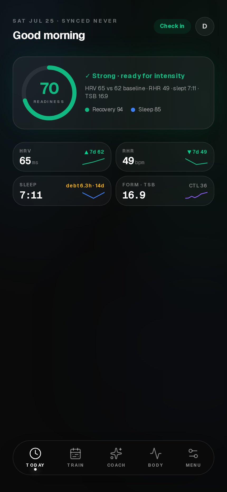
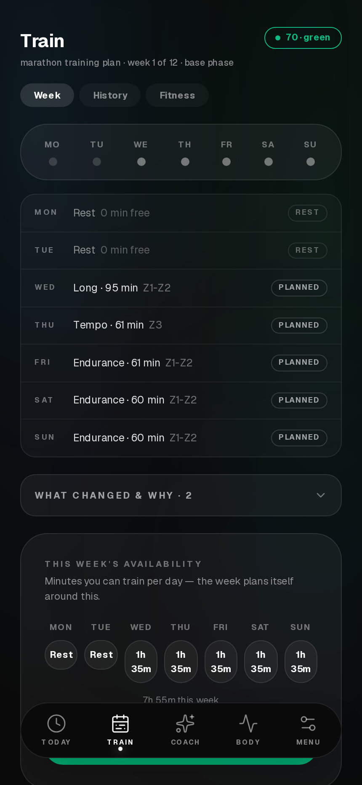
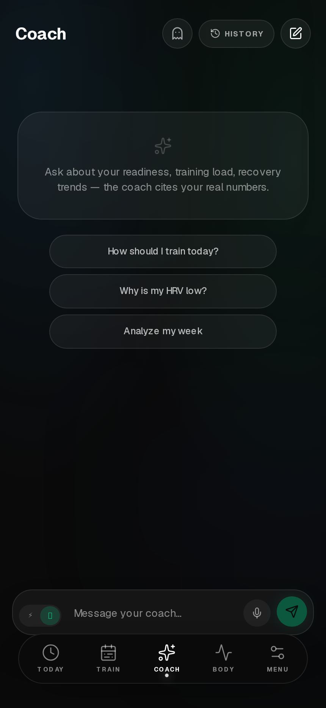
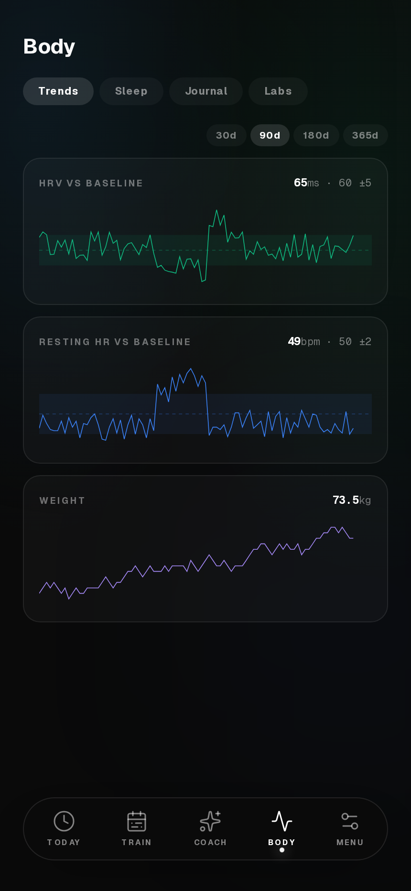

<p align="center">
  
</p>

<h1 align="center">Recover</h1>

<p align="center"><b>Your training and recovery, in one calm place — self-hosted and free.</b></p>

<p align="center">
  <a href="https://github.com/crunchynapkin404/Recover/actions/workflows/ci.yml"></a>
  <a href="https://github.com/crunchynapkin404/Recover/releases"></a>
  <a href="LICENSE"></a>
</p>

<p align="center">
  
  
  
  
</p>

Recover is a health and training companion you run on your own
hardware: readiness scoring, training load, a behavior journal, and an AI coach
— without the subscription, the wearable lock-in, or anyone else holding your
data. Start with **manual entry alone**, import a CSV, or connect
intervals.icu / Strava — your choice. Recover computes a daily readiness score
from _your_ personal baselines — not population norms — and shows it on one
calm dashboard.

Recover leads or ships nearly every top-ranked row on
[the largest public demand board in this category](https://joincycling.featurebase.app/en/roadmap)
— while staying self-hosted and free.

## Your Claude, your training data

The part we care most about: Recover ships a **built-in MCP server**, so
claude.ai, Claude Code, or any MCP client can read your readiness, wellness,
and training load with a scoped, revocable token.

> **You:** How has my week been? Should I still do intervals tomorrow?
>
> **Claude** _(via your Recover MCP connector)_: Your readiness is 66 (amber)
> — HRV 63.8 ms against a 65 ms baseline, TSB −1.9 after Saturday's long ride…

The in-app coach uses the same tools with your own LLM key — Anthropic, or any
OpenAI-compatible endpoint including a fully local Ollama. Keys are encrypted
(AES-256-GCM) in your database; nothing phones home.

## Features

- **Readiness score** from 60-day rolling personal baselines: HRV (40%),
  resting HR (25%), sleep (20%), form/TSB (15%) — with an honest
  "calibrating" state until enough history exists, and a component breakdown
  explaining every score.
- **Data freedom** — no integrations required. Log HRV, resting HR, sleep, and
  activities manually; import CSV data from any source (Apple Health, Garmin,
  Whoop, spreadsheets); or connect intervals.icu / Strava for automatic sync.
  Your readiness score unlocks after 14 days of data regardless of source.
- **Six wellness/activity sources** — intervals.icu sync keeps wellness,
  activities, and training load fresh via an in-process scheduler. **Strava
  OAuth** is a second source, with provenance tracking (Strava data is
  excluded from AI context by default, per Strava's API terms). **Whoop and
  Withings** connect via OAuth, **Oura** via a pasted personal access token,
  and **Apple Health** via Health Auto Export (a background webhook or a
  one-off file upload) — each feeding wellness alongside intervals.icu with an
  explicit per-field priority when sources overlap.
- **Analytics depth** — open any activity for stream charts (HR, power, pace,
  elevation) and laps; track fitness with CTL/ATL/TSB over 30–365 day ranges;
  watch HRV, resting HR, and sleep trend against your personal baselines.
- **Living week plan** — your training plan materializes into a concrete,
  adaptive week: set which days you're available, let poor readiness move or
  shrink sessions instead of pretending the plan still fits, and track
  planned-vs-actual drift. One tap on `/train` starts the week.
- **Race Ready** — A/B/C races are first-class, with a dashboard countdown
  card. The living week tapers automatically as race day nears (window and
  weekly load by race distance), B races get a protected pre-race ease-off,
  and race-day slots are untouchable. A pure EMA forecast projects an honest
  form band for race day — never a readiness guess — and a what-if simulator
  previews the load/form impact of a move, swap, or skip before you commit.
  The morning coach leads with a race-day brief, and a post-race debrief
  links the result and closes the loop.
- **Strength training** (v0.119.0) — opt-in per-lift 1RMs (squat, bench,
  deadlift, overhead press) drive a periodized prescription that follows the
  plan's own phase: 2 sessions/week, dropping to 1 in taper and none on a
  race week. Leave every 1RM unset and the plan is exactly what it was before
  strength existed.
- **Deeper insights** — the journal correlates behaviors against next-day
  readiness with honest 95% confidence intervals: manual tags plus auto-tags
  derived from your activities (hard sessions, double days, rest days,
  morning/late training), weekday/weekend splits, and rows that read "No
  detectable effect" or "Calibrating" instead of asserting an impact the data
  can't back. Plus real logging streaks (consecutive runs, not counts) and
  sober milestones.
- **AI coach** — evidence-based endurance-coach persona that cites the actual
  numbers from your data, adapts its tone to your readiness band, and refuses
  to program through injury or illness. BYO key: Anthropic or any
  OpenAI-compatible endpoint (Ollama included). Features:
  - **Coach Memory** — persistent knowledge store (goals, injuries, race calendar) injected into every conversation
  - **Thinking Modes** — Quick (haiku/flash) or Deep (opus/sonnet) per message
  - **Proactive Insights** — morning message generated from overnight sync data, visible on dashboard
  - **Ghost Mode** — ephemeral threads that auto-purge after 24h
  - **Personalities** — Analytical, Encouraging, or Direct tone presets
  - **Overtraining Warnings** — automatic alerts on sustained HRV suppression or RHR spikes
  - **Training plans** — periodized multi-week plans from your current fitness and a target race date; the coach tracks planned-vs-actual load each week
  - **Calendar awareness** — optional Google Calendar (FreeBusy) so suggestions fit around work and life
  - **Artifacts** — the coach can draw inline SVG charts (HRV trends, load vs recovery, PMC) right in the chat
  - **Weekly review** — a proactive written summary comparing this week's load and recovery to last week
  - **Recall over history** — full-text search across past conversations, journal notes, and reviews; the coach cites what you actually said, with dates
  - **Ride debriefs** — a card asks RPE / feel / notes after a synced ride, and the coach writes a review that quotes your own words alongside the numbers
  - **Monthly report** — the weekly review's big sibling: load, recovery, adherence, milestones, and biomarker deltas, once a month
  - **Voice input** — dictate into the chat composer (Web Speech API); it fills the box, never auto-sends
  - **Usage transparency** — token counts by model and purpose, visible in settings
- **Strava AI descriptions** — opt-in write-back that appends an emoji-rich
  metrics block (load, IF, TRIMP, form, PRs — from intervals.icu data only)
  below a separator on your Strava activities. Strava-sourced data is never
  fed to the AI coach or MCP, per Strava's API terms.
- **MCP server** — stateless streamable-HTTP endpoint at `/api/mcp` with
  hashed, scoped (`read` / `write:wellness` / `write:plan` / `write:memory` /
  `write:strava` / `write:icu`), revocable bearer tokens and rate limiting.
  59 tools: readiness (+ history), wellness, log-wellness, fitness &
  training-load summaries, power/pace curves, best efforts, activity list &
  detail, athlete profile, planned workouts, calendar availability, coach
  memory (remember/forget), recall over history (full-text search across past
  conversations and reviews), chart rendering, training-plan
  generate/get/confirm/update, Strava description write-back, the living week
  (get plan / set availability / standard week / clear override / drift),
  biomarkers, strength prescription, and races (get/upsert/delete/simulate
  plan change/pacing). Also a full intervals.icu tool set absorbed from the
  standalone `intervals-icu-mcp` server: calendar events (list/get/create/
  update/delete/bulk/duplicate), activity edits and messages, wellness push,
  sport settings, an apply-training-plan action, per-activity histograms
  (HR/power/pace/GAP), activity search & intervals, the workout library, and
  a workout-syntax reference. This surface (names, scopes, schemas) has been
  frozen since v0.20 — grown only through additive, backward-compatible
  changes to 59 tools as of v0.119.0 — see
  [docs/API-STABILITY.md](docs/API-STABILITY.md) for the guarantee and
  deprecation policy.
- **Installable PWA** — add it to your phone's home screen; a push
  notification delivers your readiness score every morning, and
  pull-to-refresh or the sync chip pulls fresh data on demand.
- **Behavior journal** — mood, energy, soreness, stress, tags, and notes
  alongside synced vitals.
- **Multi-user, invite-only** — built for one owner and a handful of friends,
  with complete data isolation. Every account can export and re-import its
  own data (GDPR portability) and list/revoke its own active sessions from
  Settings.
- **Boring operations** — one app container plus Postgres. No Redis, no queue,
  idempotent sync jobs, health endpoint, a Prometheus `/metrics` endpoint,
  migrations applied automatically on boot. Nightly `pg_dump` backups with
  rotation, a one-command restore drill that proves your latest backup
  actually restores, an owner-only admin panel for the sync-job queue, and
  outbound webhooks (readiness/band/backup events) for your own automation.
  See [docs/SELF-HOSTING.md](docs/SELF-HOSTING.md) for the full operations
  rundown, including [rollback and upgrade guarantees](docs/UPGRADING.md).

## Quickstart

```bash
git clone https://github.com/crunchynapkin404/Recover.git
cd Recover
cp .env.example .env   # then set ENCRYPTION_KEY, BETTER_AUTH_SECRET, OWNER_EMAIL, OWNER_PASSWORD
docker compose up -d
```

Open http://localhost:3000, sign in with your owner credentials, and start
logging — or connect intervals.icu under **Settings** for automatic sync.
Details, tunnel setup, upgrading, and troubleshooting:
[docs/SELF-HOSTING.md](docs/SELF-HOSTING.md). Prefer serverless? See
[docs/DEPLOY-VERCEL.md](docs/DEPLOY-VERCEL.md) for Vercel + Neon.

Want to poke around without real data? `SEED_DEMO=1 npm run db:seed-demo`
fills a demo account with 90 days of plausible training history (see
[CONTRIBUTING.md](CONTRIBUTING.md)).

## Connect Claude

1. **Settings → MCP API Tokens** → create a token (shown once).
2. Expose your instance (Cloudflare tunnel profile is built in) or use it on
   your LAN.
3. Add a custom connector in claude.ai (or `claude mcp add --transport http`)
   pointing at your instance's `/api/mcp` endpoint with the token as a bearer
   token.
4. Ask Claude about your training.

**Live demo instance:** [recover.bartabraas.nl](https://recover.bartabraas.nl/)

## Status & roadmap

**Current release: v0.119.0.** See the
[GitHub releases page](https://github.com/crunchynapkin404/Recover/releases)
or [CHANGELOG.md](CHANGELOG.md) for what shipped and when.

Recover is feature-complete against ranked external demand — the focus now is
stability first, then the overall experience. The full plan, including what's
deliberately not scheduled yet (ICS calendar export is the one real gap), lives
in [docs/ROADMAP.md](docs/ROADMAP.md).

An honest hobby project built for one owner and a handful of friends. If it's
useful to you, self-host it and make it yours. Issues and PRs welcome — see
[CONTRIBUTING.md](CONTRIBUTING.md).

## Stack

Next.js 16 · TypeScript · Postgres + Drizzle · Better Auth · Tailwind + shadcn
· hand-rolled SVG charts · Vercel AI SDK · @modelcontextprotocol/sdk

## License

AGPL-3.0 — see [LICENSE](LICENSE).
